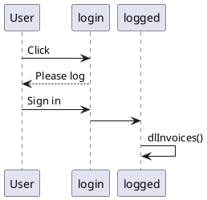

# Extension which simply the collect of invoices

When clicking it goes to the website, reconnect if needed and download the new invoices

chrome://extensions/ > `Load unpacked`

# Dev notes for myself
If I don't want to click on the popup button multiple times (when not connected to free.fr), 2 solutions:

- inject content.js from manifest.json (and open the new tab in the popup.js)
   
    "____content_scripts": [
      {
        "matches": ["https://mobile.free.fr/*"],
        "js": ["content.js"]
      }
    ],

- uses the worker to open the new tab and to inject content.js and add in manifest.json
     "host_permissions": [
      "https://mobile.free.fr/*"
    ]

# Limitations

- no autologin with Google Password Manager : a tab opened by that extension, won't have the field filled by Google Password if no interaction from the user (workaround is to store the password)

# Diagrams

https://developer.chrome.com/docs/extensions/samples
