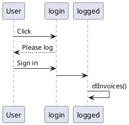

The code is currently dirty.
I've added 4 suppliers, and different approaches is used for each.
Will have to figure out for a "framework" later:
- where to locate download code (worker vs tab)
- download on the user computer or upload to GDrive, etc...
- automatically inject the code of a supplier (manifest.json > content_scripts)
- who lead the logic (worker vs tab), knowing that specific action can only be performed on one or the other

# Dev notes for myself
If I don't want to click on the popup button multiple times (when not connected to free.fr), 2 solutions:

- inject content.js from manifest.json (and open the new tab in the popup.js)

  "____content_scripts": [
  {
  "matches": ["https://mobile.free.fr/*"],
  "js": ["content.js"]
  }
  ],

- uses the worker to open the new tab and to inject content.js and add in manifest.json
  "host_permissions": [
  "https://mobile.free.fr/*"
  ]

# Limitations

- no autologin with Google Password Manager : a tab opened by that extension, won't have the field filled by Google Password if no interaction from the user (workaround is to store the password)
# Diagrams



<details>

```
@startuml firstDiagram

Alice -> Bob: Hello
Bob -> Alice: Hi!
		
@enduml
```

</details>

#JS Framework

Lit is used, because no transpiler is needed (contrary to react).
Note that preact standalone could have been used https://preactjs.com/guide/v10/getting-started/#alternatives-to-jsx and https://github.com/developit/htm


https://developer.chrome.com/docs/extensions/samples
